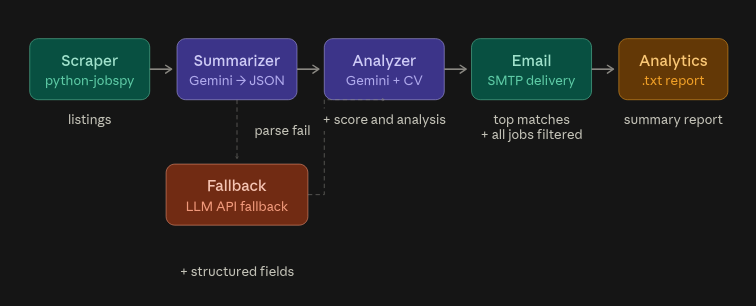
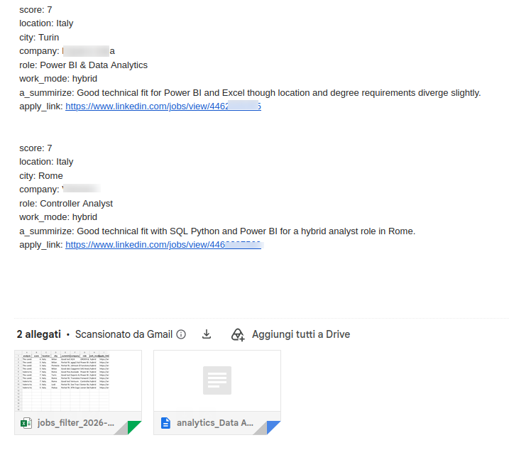

# 🔍 SnapplAI — AI-Powered LinkedIn Job Alerts

📖 [Contributing](CONTRIBUTING.md) · ❓ [Get Help](SUPPORT.md)
 
Stop refreshing LinkedIn. This pipeline scrapes new job listings based on your settings, uses AI agents to summarize each one and score it against your CV, then delivers only the best matches straight to your inbox 📬 — so you're always first to apply 🚀
 


 
---
 
## 📑 Table of Contents
 
- [The Problem](#-the-problem)
- [How It Works](#-how-it-works)
- [Tech Stack](#-tech-stack)
- [Pipeline Architecture](#-pipeline-architecture)
- [AI Output Fields](#-ai-output-fields)
- [Setup](#-setup)
- [Project Structure](#-project-structure)
- [Roadmap v2](#️-roadmap-v2)
- [Contributing](#-contributing)
- [License](#-license)
---
 
## 🎯 The Problem
 
Job hunting on LinkedIn is a full-time job in itself. New listings appear daily, most are irrelevant, and by the time you spot a good one, 200 people have already applied.
 
**SnapplAI flips the game:** it runs on a schedule, scrapes fresh listings, lets AI read and score every single one against *your* CV, and emails you only the top matches — before the crowd even sees them.
 
---
 
## ⚙️ How It Works
 
The pipeline runs in 4 sequential steps, fully automated:
 
**1. Scrape** → `job_scraper()` pulls fresh listings from LinkedIn based on your search settings (role, location, filters) using python-jobspy.
 
**2. Summarize** → `agentic_summarize()` sends each job description to Gemini, which extracts structured fields (title, seniority, skills, salary, etc.) as clean JSON.
 
**3. Analyze** → `agentic_analyze()` reads your CV and scores each listing on how well it matches your profile. Chain-of-thought enforced: the model writes `analysis` before `score` in the JSON schema, so reasoning comes before judgment.
 
**4. Deliver** → `send_email()` builds an email with the top-scored jobs and sends it to your inbox via SMTP.

**5. Apply and analytics** → Two attachments complete the report: top match, a filtered Excel with all scraped jobs, and an analytics .txt summarizing the batch.

--

**Resilience:** each Gemini call retries with exponential backoff on transient errors (`429`/`500`/`503`) and falls back through a fixed chain (`gemini-3.5-flash-lite` → `gemini-3.1-flash-lite`), so a temporarily overloaded model no longer crashes the whole pipeline.
 
**Key principle:** AI reads and evaluates. Python orchestrates and delivers. No frameworks, no agents-calling-agents — just a clean data pipeline with LLM calls where they matter.
 
---
## 🔧 Tech Stack
 
| Component | Technology |
|-----------|-----------|
| LLM | Google GenAI SDK — `gemini-3.5-flash-lite` (primary), `gemini-3.1-flash-lite` (fallback) |
| Resilience | Retry with exponential backoff + fixed model fallback chain (`src/llm.py`) |
| Scraping | python-jobspy (LinkedIn) |
| Data | pandas, PyPDF / PyMuPDF |
| Parsing | BeautifulSoup4 |
| Email | smtplib (SMTP) — provider-agnostic (Gmail, Outlook/Office365, ...) |
| Config | python-dotenv |
 
---

## 🏗️ Pipeline Architecture
 

 
The entire pipeline operates on a single pandas DataFrame that gets enriched at each step. No intermediate files, no database — everything flows through memory.
 
---
 
## 📊 AI Output Fields
 


Each job in the email is ranked by fit score and includes:

- city, company, role, and work mode
- a one-line AI summary explaining the match
- a direct apply link to the LinkedIn listing

Two attachments complete the report: a filtered Excel with all scraped jobs, and an analytics .txt summarizing the batch.

 
---
 
## 🚀 Setup
 
1. Get a free API key from [Google AI Studio](https://aistudio.google.com/apikey)
2. Generate an app password for your email (e.g. [Gmail App Password](https://myaccount.google.com/apppasswords)). For non-Gmail providers, set `SMTP_HOST`/`SMTP_PORT` in `.env` — e.g. Outlook/Office365 uses `smtp.office365.com` on port `587` (STARTTLS); Gmail defaults to `smtp.gmail.com` on `465` (SSL).
3. Place your CV (PDF) in `your_cv_config/`
4. Configure search settings: use `file_config.txt` to create your `file_config.env` ([filter docs](https://github.com/Bunsly/JobSpy))
5. Create your `.env` from the template: `cp example_env.txt .env`
### Deploy
 
#### Local
```bash
git clone https://github.com/TDK-99/SnapplAI.git && cd SnapplAI
pip install -r requirements.txt
# complete setup steps above
python main.py
```
 
#### Docker
```bash
git clone https://github.com/TDK-99/SnapplAI.git && cd SnapplAI
# complete setup steps above
docker build -t snapplai .
docker run --env-file .env snapplai
```
 
#### GitHub Actions
1. Fork this repo (or [create a private copy](#private-copy))
2. Complete setup steps 1-4 above in your fork
3. Edit your settings in `.github/workflows/snapplai.yml` under the `env:` block
4. Add credentials as **repository secrets** (Settings → Secrets → Actions): `GOOGLE_API_KEY`, `GMAIL_USER`, `GMAIL_APP_PASSWORD`
5. **Actions** tab → enable workflows → **Run workflow**

--- 
## 📁 Project Structure
 
```
SnapplAI/
├── main.py                 # Entry point — runs the 4-step pipeline
├── src/
│   ├── daily_scraper.py    # LinkedIn scraping with python-jobspy
│   ├── ai_agents.py        # Gemini calls: summarize + analyze
│   ├── llm.py              # Resilient Gemini wrapper: retry/backoff + model fallback
│   ├── smtp.py             # Email builder and SMTP sender
│   └── pydantic.py         # pydantic class for force ai output
├── tests/
│   ├── test_ai_analyze.py  # Unit test for AI analysis agent
│   ├── test_ai_summarize.py # Unit test for AI summarize agent
│   ├── test_pydantic.py    # Unit test for pydantic validation
│   └── test_smtp.py        # Unit test for SMTP email sending
├── your_cv_config/
│   ├── .gitkeep            # Keeps folder tracked in git
│   ├── file_config.env     # Your settings (role, location, filters)
│   ├── file_config.txt     # Additional config parameters
│   └── Your_CV.pdf         # Your CV goes here (PDF)
├── assets/                 # Output screenshots and docs images
├── .github/
│   └── workflows/
│       ├── snapplai.yml    # GitHub Actions workflow (scheduled + manual)
│       ├── ci.yml          # CI pipeline — runs tests on push/PR
│       └── yml.example     # Template for GitHub Actions workflow
├── Dockerfile              # Run anywhere with Docker
├── .env                    # API keys and SMTP credentials (git-ignored)
├── .gitignore
├── example_env.txt         # Template for .env variables
├── requirements.txt        # Dependencies
├── CONTRIBUTING.md         # Contribution guidelines
├── SUPPORT.md              # Support and contact info
├── LICENSE                 # MIT
└── README.md
```

 
---
## 🛣️ Roadmap v2
 
- ✅**Multi-country scraping** — search across 2+ countries in a single run (custom feature, not supported by python-jobspy out of the box)
- **Excel/DB deduplication** — persistent storage to compare runs and filter out already-seen listings, so you never score the same job twice
- **Scoring calibration** — benchmark AI scores against known good/bad matches to improve match quality
- **Output redesign** — better visual formatting for the email report (job cards, readability, direct links)
- **Fix issue** — fix main issue: fallback model, smtp for non @gmail user and github action new user
 
## 🤝 Contributing

Contributions are welcome — bug fixes, new features, or docs improvements.

- **Issues** — Report bugs or suggest features
- **Pull Requests** — Fork, build, submit

---
 
## 📄 License
 
MIT — see [LICENSE](LICENSE)
